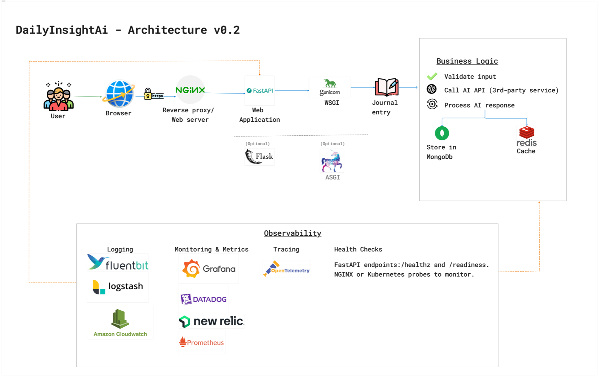
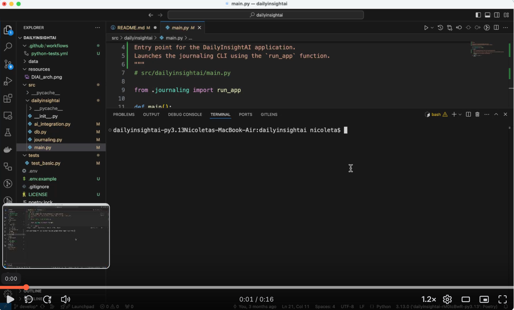

# DailyInsight AI

> Your personal journaling assistant powered by Generative AI — reflect better, grow smarter.

---

## 

---

## 🧠 What is DailyInsight AI?

**DailyInsight AI** is a personalized journaling and idea management app that uses GenAI to:
- Generate insights and summaries from your journal entries
- Store them securely in the cloud via MongoDB Atlas
- Offer a lightweight, structured way to reflect daily — for personal growth, mood tracking, and idea capture

> 🧪 **Current version** is CLI-based. Web interface coming soon!

---

## 🚀 Features (Current Iteration)

- ✍️ Add free-form journal entries via the command line
- 🧠 Get AI-generated insights (via OpenAI integration)
- 💾 Store data securely in MongoDB Atlas
- 🔐 Manage secrets and config via environment variables in `.env` (e.g., OpenAI key, Mongo URI, and DEBUG mode). Secrets are controlled using environment variables, and debug output can be toggled.
- 🧪 Automated testing using Pytest and GitHub Actions for continuous integration
- 📝 Clear, structured docstrings across all modules
- 🛠️ Project scaffolded using Poetry (dependency + packaging)

---

## 🛠️ Tech Stack

| Layer         | Tech                          |
|---------------|-------------------------------|
| Language      | Python 3.13                   |
| AI Integration| OpenAI GPT (via `openai` lib) |
| Database      | MongoDB Atlas (via `pymongo`) |
| Runtime       | CLI (initial), FastAPI future |
| Tooling       | Poetry, python-dotenv, pytest |


## ⚙️ Setup Instructions

### 1. Clone and Install

```bash
git clone https://github.com/nmo-genio/dailyinsightai.git
cd dailyinsightai
poetry install
```

### 2. Run the App

```bash
poetry run python -m dailyinsightai.main
```

---

## 👩‍💻 Built by Nicoleta Mocanu

This project was built with love for reflection, growth, and AI experimentation.  
If you have feedback or ideas, feel free to open an issue or connect on [LinkedIn](https://www.linkedin.com/in/nicoletamocanu/).

## 🎥 Demo Video

Click to watch a quick walkthrough of DailyInsight AI in action:

[](https://www.loom.com/share/23bdbb05d9a248b7b26a34c1b20ed88b)